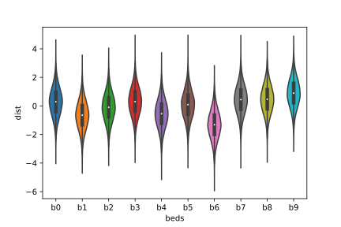
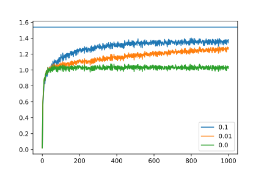
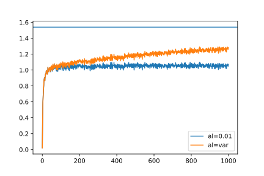

# Reinforcement Learning: Multi-armed Bandits

Imagine yourself on a vacation at your favorite gambling destination. Unsure of where to start, you want to warm up with a slot machine. But the house has a new trick up its sleeve, it wants you to indulge simultaneously on ten machines instead of just one, and for now it has allowed you to play on them for reasonably large amount of time. Also, with each crank of the lever, each machine is ready to shell out some monetary reward. What strategy do you employ to walk away with maximum number of rewards?

By now you must be getting some sense of a trade-off needed to do well at this game — something along the lines of figuring out the best slot machine by trial and error and then cranking its lever to maximize rewards. But, considering your playing time is bounded in some sense — you would want to make that determination fast. But each time you try to make that determination (explore), you may not be able to maximize rewards (exploit), and here lies the real challenge of the multi-armed bandit problem.

The multi-armed bandit problem is a classical problem in reinforcement learning paradigm. A typical reinforcement learning problem uses training information to *evaluate* the action rather than *instruct* by prescribing correct action. In addition, the multi-armed bandit framework is *non-associative*, i.e. it does not involve learning in more than one situation — unlike frameworks such as Contextual Bandits, or Markov Decision Process, which are out of scope for this article.

## Algorithm

The action taken at each step \\(t\\) is represented as \\(A_{t}\\) results in a reward \\(R_{t}\\), and can be modeled as following a probability distribution with mean or expected value \\(q_{*}(a)\\) — also known as the *value* of the action \\(a\\). Since we don’t have any knowledge of inner workings of the slot machine(s), the value of any given action unknown to us — so the best we can do is to estimate it on-the-fly while we explore. Let's call it the *action value estimate* \\(Q_{t}\(a\)\\). Note that the it has a time subscript to denote that it is always updated as we learn more and more about the rewards for a given action. Formally, it can be defined as

$$
Q_{t}(a) \equiv \frac{\textrm{sum of rewards (\\(R_{t}\\)) when \\(a\\) taken before \\(t\\)}}{\textrm{number of times \\(a\\) taken before \\(t\\)}}
$$

At each step, given the action value estimate, we are faced with a choice to choose the *greedy* action that would give us the maximum rewards, or explore randomly to figure out the best action. Let’s assign a variable \\(\epsilon\\) to denote the probability when we explore randomly over choosing greedily. While exploring, any action among the lot is chosen with uniform probability. Formally this can be written as

$$
A_{t} = \begin{cases}
\mathop{\operatorname{argmin}}\limits_{a} Q_{t}(a) &\quad{X_{t} \sim U[0,1)} > \epsilon \\\\
U_{D}(1, n) &\quad{\textrm{otherwise}}  \end{cases}
$$

Let’s unpack the above equation. At each step, we draw a random number \\(X_{t}\\) from a uniform distribution between 0 and 1. If that number is greater than \\(\epsilon\\), we choose to exploit greedily and consequently choose the action with maximum estimated value. Otherwise, we choose to explore and pick an action from discrete uniform random distribution between 1 to \\(n\\) (total number of actions)

## Implementation

Let’s model the numerical problem of bandits using a 10-armed testbed, where each bandit’s reward process is modeled as a Gaussian distribution \\(N (q_{*}(a), 1)\\). The action values, in turn, are also drawn from a Gaussian distribution with mean 0 and variance 1. We can represent the testbed with the following class


import uuid
import numpy as np

class TestBed(object):
    def __init__(self, n, seed):
        self.n = n # number of bandits
        self.seed = seed # random seed
        self.rng = np.random.default_rng(self.seed) # rewards
        self.mu = self.rng.normal(0, 1.0, self.n) # action values means
        self.sig = np.ones(self.n, dtype=np.float32) # action values variance
        self.id = uuid.uuid1() # id of the testbed

    # At each step, we draw the reward from a normal (Gaussian) distribution
    # with mean and variance for the corresponding bandit
    def get_dist(self, index, size=1):
        return self.rng.normal(self.mu[index], self.sig[index], size=size)

    # Helper function for representation
    def __str__(self) -> str:
        return (
            f"{self.n}-armed Testbed\n"
            f"Id: {self.id.hex}\n"
            f"Random Seed: {self.seed}\n"
            f"Max. Expected Value: {np.max(self.mu)}\n"
        )


We can visualize the testbed with the following violin plot.

Fig.1: Representation of one instance of testbed.

To simulate a multi-armed bandit experiment, we create a class `BanditExperiment` . It takes in the testbed object as an input, and performs a single run (balancing exploration and exploitation) for specified number of steps. To update the action value expectation iteratively each step, we use the following update rule.

$$
Q_{t+1} = Q_{t} + \alpha (R_{t} - Q_{t})
$$

where \\(\alpha\\) is the relaxation parameter or the step size. We can choose it to be a fixed value, however, it can be conclusively shown that in the standard update rule, \\(\alpha = 1/t\\) where t is the step. Therefore, the relaxation can itself is updated as

$$
\alpha_{t+1} = \frac{\alpha_{t}}{( \alpha_{t} + 1)}
$$

Putting it all together, our experiment class looks like


import numpy as np
from timeit import default_timer as timer

class BanditExperiment(object):
    def __init__(self, epsilon, testbed, alpha=None, seed=1993):
        self.epsilon = epsilon # probability of exploration
        self.testbed = testbed
        self.seed = seed
        self.expected_rewards = np.zeros_like(self.testbed.mu, dtype=np.float32) #Q_{t}(a)
        self.rng = np.random.default_rng(self.seed)
        # Relaxation strategy
        if alpha:
            self.update_alpha = False
            self.alpha = np.ones_like(self.testbed.mu, dtype=np.float32) * alpha
        else:
            self.update_alpha = True
            self.alpha = np.ones_like(self.testbed.mu, dtype=np.float32)

    # Helper function to pick action A_{t}
    def _explore_or_exploit(self):
        if self.rng.random() > self.epsilon:
            return np.argmax(self.expected_rewards)
        else:
            return self.rng.integers(self.testbed.n)

    # Update action values given action i is picked
    def _update_action_value_expectation(self, i):
        old_expected_reward = self.expected_rewards[i]
        reward = self.testbed.get_dist(i)
        if self.update_alpha:
            self.alpha[i] = self.alpha[i] / (self.alpha[i] + 1)
        self.expected_rewards[i] = old_expected_reward + self.alpha[i] * (
            reward - old_expected_reward
        )
        return reward

    # Run bandit experiment for steps, print status echo_every timesteps
    def run(self, steps, echo_every=-1):
        rewards = np.zeros(steps, dtype=np.float32)
        start = timer()
        for s in range(steps):
            action_arg = self._explore_or_exploit()
            rewards[s] = self._update_action_value_expectation(action_arg)
            if echo_every > 0 and ((s + 1) % echo_every) == 0:
                print(f"Finished step: {s+1}, elapsed time: {timer()-start}")
        return rewards

    # Helper function for representation
    def __str__(self) -> str:
        return (
            f"Epsilon: {self.epsilon}\n"
            f"Relaxation: {self.alpha}\n"
            f"Random Seed: {self.seed}\n"
            f"TestBed: {self.testbed.__str__()}\n"
        )


We are now ready to launch experiments, and since all of them are independent runs, we can employ embarrassingly parallel loops.


import numpy as np
from joblib import Parallel, delayed

# perform single run
def do_single_run(num_bandits, steps, epsilon, alpha, seed1, seed2):
    testbed = TestBed(num_bandits, seed1)
    epg = BanditExperiment(epsilon, testbed, alpha, seed2)
    return epg.run(steps), np.max(testbed.mu)

# average out runs using joblib.Parallel
def avg_runs(num_bandits, num_runs, steps, epsilon, alpha, seed, workers=1):
    rng = np.random.default_rng(seed)
    rewards, max_expected_reward = zip(*Parallel(n_jobs=workers)(
        delayed(do_single_run)(
            num_bandits, steps, epsilon, alpha, rng.integers(10000), rng.integers(10000)
        )
        for _ in range(num_runs)
    ))
    return np.mean(np.array(rewards), axis=0), np.mean(np.array(max_expected_reward), axis=0)


## Analysis

### Behavior of \\(\epsilon\\)

We consider three values of \\(\epsilon\\), 0 (greedy), 0.01, and 0.1. The number of bandits in the testbed is set to 10, number of steps is 1000, total number of independent runs is 5000. Relaxation parameter \\(\alpha\\) is not specified in these runs, therefore it will be updated dynamically. We also calculate the maximum expected reward (which remains unchanged with \\(\epsilon\\)). From the plot, we see that the greedy action saturates quickly to a lower value of expected reward because it does not explore other actions. Additionally, we see that more exploration \\(\epsilon=0.1\\) leads to quick jump in expected rewards but they plateau, compared to a slower exploration case \\(\epsilon=0.01\\) — where we see a consistent rise in expected rewards with respect to time.

Fig. 2: Expected rewards variation with exploration probability

### Behavior of \\(\alpha\\)

To study the behavior of expected rewards variation with \\(\alpha\\), we fix \\(\epsilon=0.01\\), with total number of steps as 1000 and averaging data over 5000 runs. It can be seen that the variable relaxation parameter converges faster to maximum expected reward. However, one cannot completely discount using a fixed relaxation parameter value because can be useful when the bandit rewards distribution is non-stationary (changes with time).

Fig. 3: Expected rewards variation with relaxation parameter \\(\alpha\\)

## Conclusion

In this article, we formalized the framework and code for solving the multi-armed bandit problem, which is a special case of evaluative feedback framework. Our current problem assumes a stationary reward distribution, with a non-associative aspect. In further articles, we will tackle these problems.
 